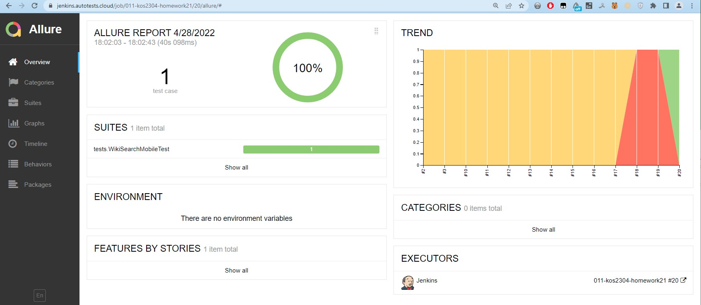
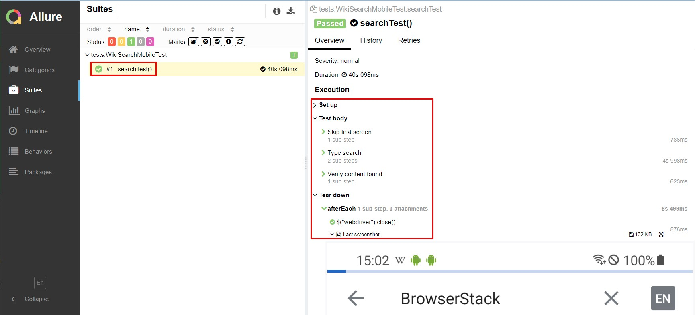
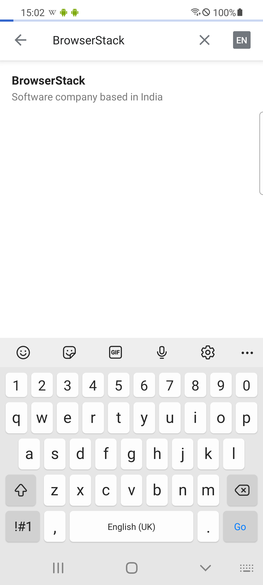
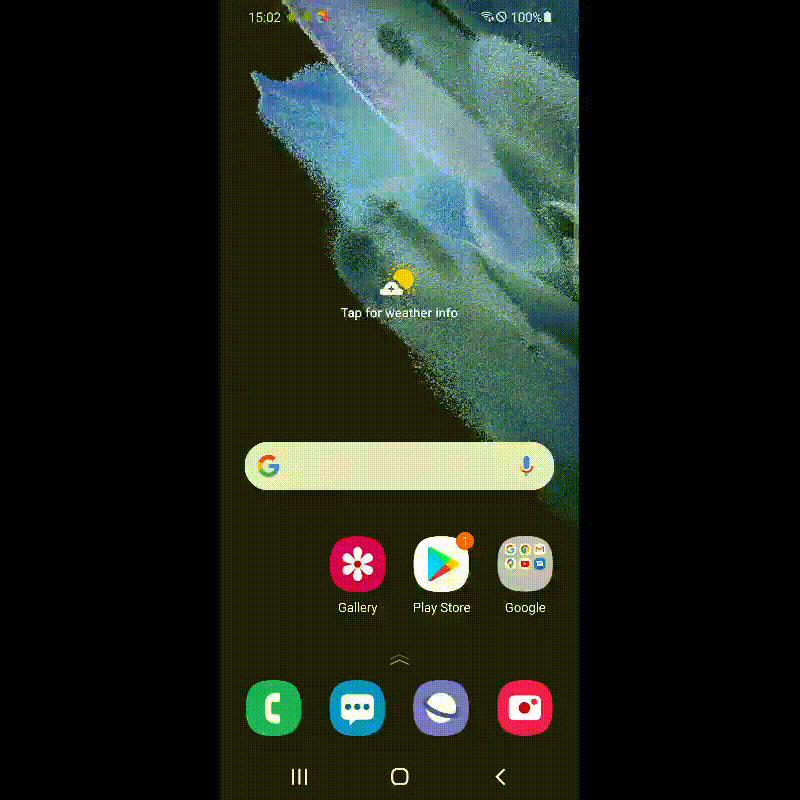

# Пример выполнения мобильного тестирования с Browserstack
## :unicorn: Pet-projects: мобильное приложение Wikipedia
1. Из открытого источника взят установщик мобильного приложения:  <a target="_blank" href="https://github.com/wikimedia/apps-android-wikipedia/releases/tag/latest">wikimedia/apps-android-wikipedia</a>
2. Установщик загружен в demo-учетную запись <a target="_blank" href="https://www.browserstack.com/">BrowserStack</a> (сервис платный)
3. Выбран желаемый эмулятор мобильного устройства (в данном примере это телефон Samsung Galaxy S21, OS 11.0)
4. Добавлен тест, проверяющий работу поиска в Wikipedia (в данном примере это запрос "BrowserStack")
5. Получены результаты теста в формате Allure отчета
6. Добавлены артефакты тестирования (скриншот и видео) 

## :four_leaf_clover: Allure 
###### Главный экран Allure отчета (Owerwiev)

###### Страница Allure с проведенными тестами (Suites)

## :watermelon: Скриншот прохождения тестов
К каждому тесту прилагается автоматически сгенерированный скриншот показывающий состояние исследуемого приложения на момент остановки теста. Пример:

  

## :watermelon: Видео прохождения тестов
К каждому тесту прилагается автоматически сгенерированное видео. Пример:

  

-------
ver1 2022-04-28
